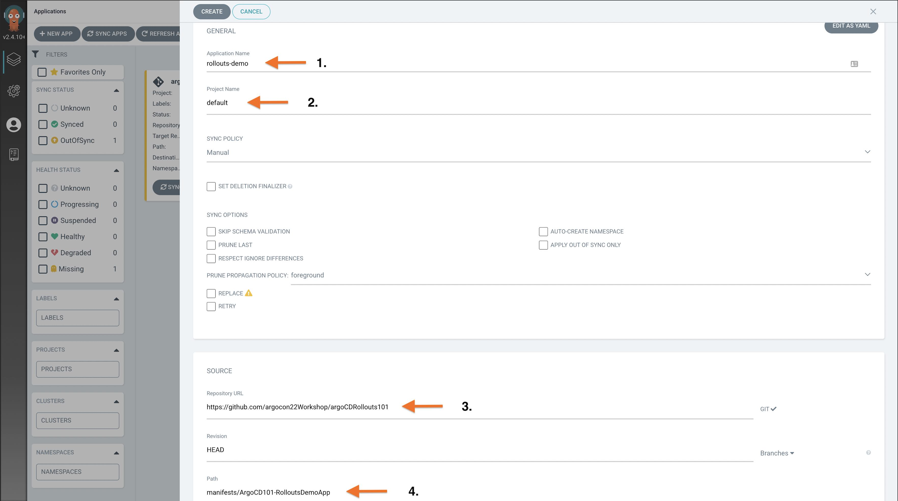
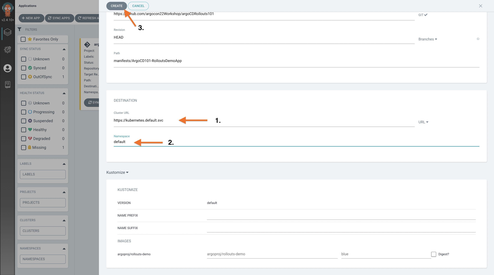

##
1. Prerequisites Setup

    For the 101 session we will require Docker for Desktop with Kubernetes Enabled, and homebrew installed.

    You can install Docker for Desktop by following the instructions on the [Docker for Desktop](https://docs.docker.com/get-started/#download-and-install-docker) page.

    You can install homebrew via the following command:

    ```
    /bin/bash -c "$(curl -fsSL https://raw.githubusercontent.com/Homebrew/install/HEAD/install.sh)"
    ```

    You can check your setup by running the precheck script found at `scripts/prereq-check.sh` of this repo.

1.  Argo CD installation


    ### Setup Argo CLI Tools
    #### OSX
    ```bash
    brew install argocd
    brew install argoproj/tap/kubectl-argo-rollouts
    ```

    ### Setup ArgoCD
    ```
    kubectl create namespace argocd
    kubectl apply -n argocd -f https://raw.githubusercontent.com/argoproj/argo-cd/stable/manifests/install.yaml
    ```
    #### Username: `admin` Password: `run command below`
    ```
    kubectl -n argocd get secret argocd-initial-admin-secret -o jsonpath="{.data.password}" | base64 -d
    ```
    #### Access UI
    Run the following command to access the UI in a new terminal window:

    ```
    kubectl port-forward svc/argocd-server -n argocd 8080:443
    ```
    Visit the UI at `http://localhost:8080`.


1. Setup guestbook application
    -   Fork this repo first then replace `<username>` with your GitHub username in the commands below.
    ```
    argocd --port-forward --port-forward-namespace argocd login
    argocd --port-forward --port-forward-namespace argocd repo add https://github.com/<username>/ArgoCDRollouts
    argocd --port-forward --port-forward-namespace argocd app create guestbook --repo https://github.com/<username>/ArgoCDRollouts --path manifests/ArgoCD101-GuestbookApplicationManifests --dest-namespace default --dest-server https://kubernetes.default.svc
    argocd --port-forward --port-forward-namespace argocd app sync guestbook
    ```

1. ArgoCD Exercises:
    - Exercises is based on Argo CD and Gitops concepts. The purpose of this is to familiarize you with the  interface of ArgoCD & Argo CLI.
        - [Task 1](Task-101-ArgoCD/task1.md) -  Application Sync Status
        - [Task 2](Task-101-ArgoCD/task2.md) -  Sync Policy & Options
        - [Task 3](Task-101-ArgoCD/task3.md)  - Declarative Setup (GitOps)

1. Setup Argo Rollouts Controller
    ```
    kubectl create namespace argo-rollouts
    kubectl apply -n argo-rollouts -f https://github.com/argoproj/argo-rollouts/releases/latest/download/install.yaml
    ```
    `You can now view and sync the application at: https://localhost:8080/applications/argo-rollouts`

1. Deploy Argo Rollouts Demo App and Nginx Ingress Controller via UI

    1. Click on the  `New App`
    1. Fill the application details 
    1. Click on the `Create` button  to create argo rollout application
    1. Click on the `Sync` button within the application to deploy.


1. Argo Rollout Exercises
    - [Deployment Strategies](https://argoproj.github.io/argo-rollouts/concepts/#deployment-strategies)
        - [Task 1](Task-101-Rollouts/task1.md) - BasicCanary Rollout
        > A canary rollout is a deployment strategy where the operator releases a new version of their application to a small percentage of the production traffic.

1. ArgoCD and ArgoRollouts integrations
    - [Custom Health Check](https://argo-cd.readthedocs.io/en/stable/operator-manual/health/#custom-health-checks)
    - [Custom Action](https://argo-cd.readthedocs.io/en/stable/operator-manual/resource_actions/#custom-resource-actions)
        - Define a Custom Health Check in argocd-cm ConfigMap
        - Contribute to resource customization
            - https://github.com/argoproj/argo-cd/tree/master/resource_customizations
#### Argocd Project documentation
- [ArgoCD Documentation](https://argo-cd.readthedocs.io/)
- [Argo Rollout](https://argoproj.github.io)
- [Application Set](https://argo-cd.readthedocs.io )